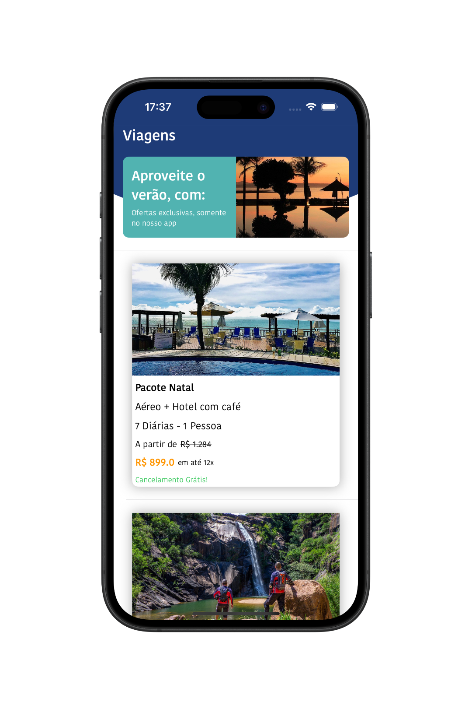
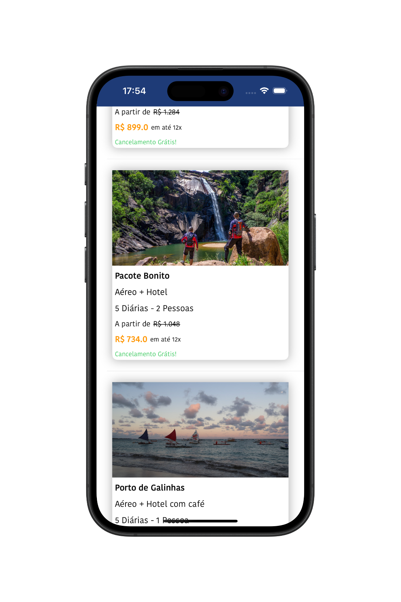

# 📱 Trips - App de Pacotes de Viagem

O **Trips** é um aplicativo simples desenvolvido com **UIKit**, que apresenta pacotes de viagens por meio de uma **UITableView** com células e cabeçalhos customizados usando arquivos **XIB**.

  
  

## 🛠 Tecnologias Utilizadas

- Swift  
- UIKit  
- Storyboard
- XIBs (Interface Builder Files)
- Auto Layout
- UITableView  
- MVVM (Model-View-ViewModel) 
- JSON Local (Mock de Requisição)

## 👨🏻‍💻 Como Usar o Aplicativo

- Baixe o projeto e abra com o Xcode.
- Execute o aplicativo em um simulador iOS ou iPhone físico.
- Deslize a tela para visualizar os pacotes de viagens.

## 📌 Observação

Este projeto foi desenvolvido com fins educacionais como prática de desenvolvimento iOS com **UIKit**, **Storyboard**, **XIBs** e uma estrutura leve baseada em **MVVM**. Ele simula uma chamada de API através da leitura de um arquivo **JSON local**.
